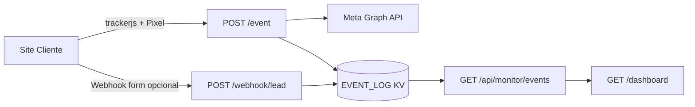

# Framework CAPI — Playbook técnico padrão

Este documento transforma o projeto em um **framework replicável por cliente**.
Objetivo: subir um novo CAPI com monitor operacional em poucas etapas, alterando apenas variáveis/secrets.

## 1) Arquitetura de referência



## 2) Responsabilidades por artefato

- `worker.js`: CORS, validações, hashing de `user_data`, envio Meta, webhook de lead.
- `monitor/`: API + UI de monitor (eventos CAPI, leads, correlação por `event_id`).
- `tracker.js`: script browser unificado (Pixel + CAPI) com deduplicação.
- `wrangler.toml`: rotas, vars públicas e binding KV `EVENT_LOG`.

## 3) Variáveis e secrets obrigatórios

### Vars públicas

- `PIXEL_ID`
- `META_API_VERSION` (ex.: `v21.0`)
- `ALLOWED_ORIGINS` (produção: domínio explícito)
- `WORKER_ENV` (`production` ou `development`)
- `TEST_EVENT_CODE` (opcional em validação)
- `EXPOSE_META_ERRORS` (normalmente `false`)
- `WORKER_EVENT_URL` (referência humana)

### Secrets

- `META_ACCESS_TOKEN` (**obrigatório**)
- `MONITOR_TOKEN` (recomendado em produção)
- `WEBHOOK_TOKEN` (recomendado se usar `/webhook/lead`)

Comandos:

```bash
npx wrangler secret put META_ACCESS_TOKEN
npx wrangler secret put MONITOR_TOKEN
npx wrangler secret put WEBHOOK_TOKEN
```

## 4) Snippet padrão do site

```html
<script
  src="https://track.seudominio.com.br/trackerjs"
  data-endpoint="https://track.seudominio.com.br/event"
  data-pixel-id="SEU_PIXEL_ID"
  async
></script>
```

Disparo de Lead no sucesso real do formulário:

```js
window.MetaTracker.track("Lead", {
  custom_data: {
    form_name: "contato_principal",
    channel: "whatsapp",
    page_path: location.pathname,
    value: 1,
    currency: "BRL"
  },
  user_data: {
    em: email,
    ph: phone,
    fn: firstName,
    ln: lastName,
    ct: city,
    st: state,
    zp: zip,
    country: "br",
    external_id: crmId
  }
});
```

Observação: o Worker normaliza e aplica SHA-256 automaticamente nas chaves avançadas de `user_data` (EMQ).

## 5) Webhook de formulário (opcional, recomendado)

Rota: `POST /webhook/lead`

Headers:

- `Authorization: Bearer <WEBHOOK_TOKEN>`

Payload mínimo:

```json
{
  "event_id": "uuid-opcional",
  "event_name": "Lead",
  "name": "Nome",
  "email": "lead@exemplo.com",
  "phone": "+55 11 99999-9999",
  "source": "form_site",
  "page_url": "https://www.cliente.com/landing"
}
```

Benefício: dashboard mostra linha de lead mesmo antes/independente do retorno Meta, e correlaciona depois por `event_id`.

## 6) Checklist de validação (go-live)

1. `GET /health` retorna `ok: true`.
2. `GET /trackerjs` retorna `200` (`application/javascript`).
3. No browser: `POST /event` retorna `ok: true`.
4. Events Manager: evento navegador + servidor deduplicado por `event_id`.
5. Dashboard `/dashboard`:
   - métricas carregam,
   - tabela de eventos mostra `ok/erro`,
   - tabela de leads e correlação exibem `event_id`.
6. `EVENT_LOG` ativo no KV (`kv_configured: true` na API do monitor).

## 7) Troubleshooting por sintoma

### A) `POST /event` = 500 `missing_env`

- `META_ACCESS_TOKEN` e/ou `PIXEL_ID` ausente no Worker.

### B) `POST /event` = 403 `origin_not_allowed`

- `ALLOWED_ORIGINS` não inclui a origem do site (https).

### C) Dashboard vazio

- `EVENT_LOG` não configurado no `wrangler.toml`,
- ou sem tráfego real após deploy,
- ou token de monitor incorreto.

### D) `wrangler secret put ...` erro `10053`

- binding já existe como variável texto no Dashboard; remover e recriar como Secret.

### E) Meta mostra só Navegador (sem Servidor)

- script não carregou (`/trackerjs` 404),
- `data-endpoint` incorreto,
- erro 500 em `/event` (ver Network/Response).

## 8) Padrão para novos clientes

1. Duplicar projeto.
2. Ajustar domínios (`track.cliente.com`) e rotas no `wrangler.toml`.
3. Inserir vars/secrets do cliente.
4. Publicar Worker.
5. Publicar snippet no site.
6. Validar com `TEST_EVENT_CODE`; depois remover.
7. Entregar dashboard com token e checklist de operação.
